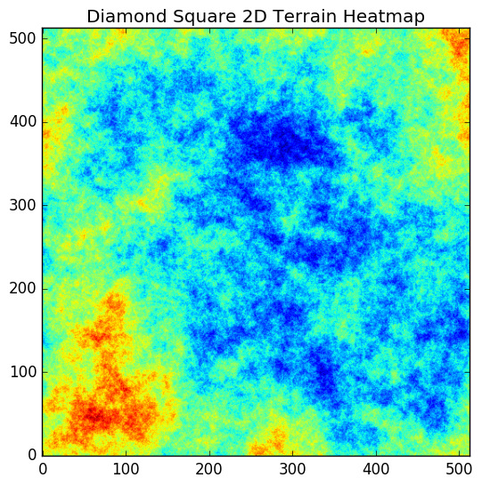

# Diamond_Square
Implementation of Diamond Square algorithm.

## Setup instructions
This project uses a [`Makefile`](https://www.gnu.org/software/make/) 
in which several targets are provided for ease of use.

For a minimal setup run `make setup` to install requirements:
- `matplotlib==1.5.3` 
- `numpy==1.11.2`)
 
Running `make run` will run the code.

## Diamond-Square Algorithm

###  Overview ###

### Initial Conditions
Input values are the G_SIZE which defines grid size according to (2^G_SIZE + 1) & G_MAX_RND for minimum and maximum random number.
G_SIZE serves as a measure of level which is looped 0 -> G_SIZE.  where 0 
starts with large shapes and G_SIZE represents the smallest shapes according to 
below image. [Source](https://en.wikipedia.org/wiki/Diamond-square_algorithm).

The function _rnjesus takes single input value N and generates a random value between -N -> +N.

The grid is seeded with 4 random values in range -G_MAX_RND -> +G_MAX_RND.
Each point is computed by taking the average and adding a random number to 
it. This random number is reduced at each level [see image](#Overview) 
according to G_SIZE/(level+1).  This is a crude implementation but allows for sufficiently random terrain & sufficient smoothness.

### Square Step

Square step (so called as reference points form a square) is computed simply.
C is the computed point using marked points below.

      NW          NE
            C
      SW          SE

### Diamond Step

Diamond step (so called a reference points form a diamond) requires a wrapping if the index are minimum and maximum values.
The loop also has some redundancies as two points will be looked at twice however once a point has been assigned a value it will not be recomputed.

N,W,S,E are computed using surrounding reference points. NN, WW, EE, SS are points which wrap if outside index range.

                  NN
            NW    N     NE
      WW    W     C     E     EE
            SW    S     SE
                  SS

## Sample images

### Three Dimensional

### Two Dimensional

